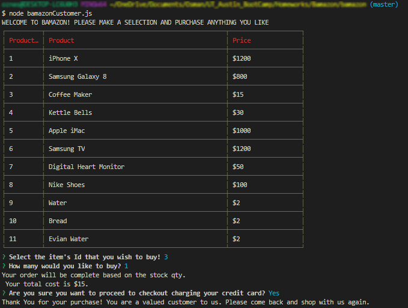

# Bamazon - OnlineStore w NodeJS
A simple easy to use NodeJS based online store front application reading and updating data from MySQL. 



Prototype: clone the repo

 - Technology: NodeJS, MySQL w/Sequelize

## [](https://github.com/onaseer07/bamazon#getting-started)Getting Started

These instructions will get you a copy of the project up and running on your local machine for development and testing purposes.

### [](https://github.com/onaseer07/bamazon#prerequisites)Prerequisites

Bamazon is built using NodeJS with Inquirer, Table and MySQL npm. To install the required packages, just clone the repository and use the node package manager to install all of the relevant packages.

```
npm install
node bamazonCustomer.js

```

## [](https://github.com/onaseer07/bamazon#built-using)Built Using

-   Node
-   MySQL w/Sequelize
-   Inquirer
-  	Table

## [](https://github.com/onaseer07/bamazon#authors)Author

(alphabetical by first name)

-   **Osman Naseer**  -  [Github](https://github.com/onaseer07)


## [](https://github.com/onaseer07/bamazon#acknowledgments)Acknowledgments

-   Developed this backend application as part of the UT Coding Boot Camp project to showcase skills in building full stack application using NodeJS. 

> Written with [StackEdit](https://stackedit.io/).
